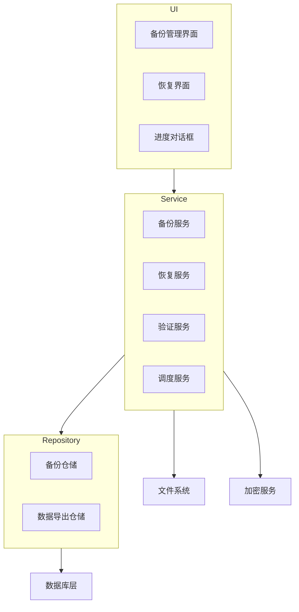
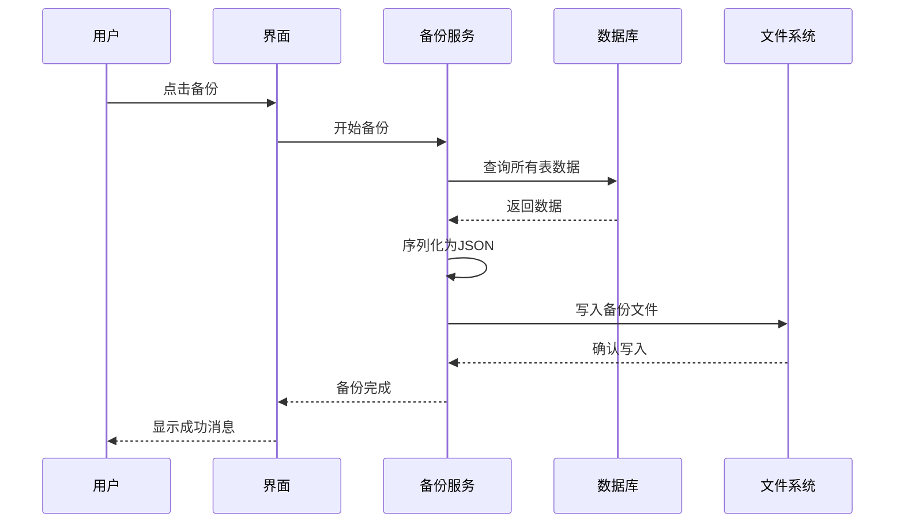

# 数据备份和恢复功能设计文档

## 概述

本设计文档描述了为Stocko库存管理应用实现数据备份和恢复功能的技术方案。该功能将允许用户导出所有业务数据到JSON格式的备份文件，并能够从备份文件中恢复数据。设计遵循现有的项目架构模式，使用Drift数据库、Riverpod状态管理和Flutter的文件系统API。

## 架构

### 整体架构图



### 数据流架构



## 组件和接口

### 1. 核心服务接口

#### IBackupService
```dart
abstract class IBackupService {
  Future<BackupResult> createBackup({
    String? customName,
    bool includeImages = false,
    bool encrypt = false,
    String? password,
  });
  
  Future<List<BackupMetadata>> getLocalBackups();
  Future<bool> deleteBackup(String backupId);
  Future<BackupMetadata?> getBackupInfo(String filePath);
}
```

#### IRestoreService
```dart
abstract class IRestoreService {
  Future<BackupMetadata> validateBackupFile(String filePath);
  Future<RestoreResult> restoreFromBackup({
    required String filePath,
    required RestoreMode mode,
    String? password,
    List<String>? selectedTables,
  });
  Future<RestorePreview> previewRestore(String filePath);
}
```

### 2. 数据模型

#### BackupMetadata
```dart
@freezed
class BackupMetadata with _$BackupMetadata {
  const factory BackupMetadata({
    required String id,
    required String fileName,
    required DateTime createdAt,
    required int fileSize,
    required String version,
    required Map<String, int> tableCounts,
    required String checksum,
    @Default(false) bool isEncrypted,
    String? description,
  }) = _BackupMetadata;
}
```

#### BackupData
```dart
@freezed
class BackupData with _$BackupData {
  const factory BackupData({
    required BackupMetadata metadata,
    required Map<String, List<Map<String, dynamic>>> tables,
    Map<String, dynamic>? settings,
  }) = _BackupData;
}
```

### 3. 用户界面组件

#### BackupManagementScreen
- 显示本地备份文件列表
- 提供创建新备份的功能
- 支持备份文件的管理操作（删除、重命名、分享）

#### RestoreScreen
- 文件选择界面
- 恢复选项配置
- 进度显示和结果反馈

#### BackupProgressDialog
- 实时显示备份/恢复进度
- 支持取消操作
- 错误处理和重试机制

## 数据模型

### 备份文件结构

```json
{
  "metadata": {
    "id": "backup_20241227_143022",
    "version": "1.0.0",
    "createdAt": "2024-12-27T14:30:22.000Z",
    "appVersion": "1.0.0+1",
    "schemaVersion": 22,
    "checksum": "sha256_hash_value",
    "isEncrypted": false,
    "tableCounts": {
      "products": 150,
      "categories": 12,
      "units": 8,
      "stock": 300
    }
  },
  "data": {
    "products": [...],
    "categories": [...],
    "units": [...],
    "unit_products": [...],
    "shops": [...],
    "suppliers": [...],
    "product_batches": [...],
    "stock": [...],
    "inventory_transactions": [...],
    "locations": [...],
    "inbound_receipts": [...],
    "inbound_items": [...],
    "purchase_orders": [...],
    "purchase_order_items": [...],
    "barcodes": [...],
    "customers": [...],
    "sales_transactions": [...],
    "sales_transaction_items": [...],
    "outbound_receipts": [...],
    "outbound_items": [...]
  },
  "settings": {
    "autoBackupEnabled": true,
    "backupFrequency": "weekly"
  }
}
```

### 数据库表映射

基于现有的Drift数据库结构，需要备份的表包括：

1. **基础数据表**
   - products (产品)
   - categories (分类)
   - units (单位)
   - unit_products (产品单位关系)
   - shops (店铺)
   - suppliers (供应商)
   - customers (客户)

2. **库存相关表**
   - product_batches (产品批次)
   - stock (库存)
   - inventory_transactions (库存交易)
   - locations (货位)

3. **业务单据表**
   - inbound_receipts (入库单)
   - inbound_items (入库单明细)
   - outbound_receipts (出库单)
   - outbound_items (出库单明细)
   - purchase_orders (采购单)
   - purchase_order_items (采购单明细)
   - sales_transactions (销售交易)
   - sales_transaction_items (销售交易明细)

4. **辅助数据表**
   - barcodes (条码)

## 错误处理

### 错误类型定义

```dart
enum BackupErrorType {
  fileSystemError,
  databaseError,
  serializationError,
  encryptionError,
  validationError,
  insufficientSpace,
  permissionDenied,
}

@freezed
class BackupException with _$BackupException implements Exception {
  const factory BackupException({
    required BackupErrorType type,
    required String message,
    Object? originalError,
    StackTrace? stackTrace,
  }) = _BackupException;
}
```

### 错误处理策略

1. **文件系统错误**：检查存储权限和可用空间
2. **数据库错误**：事务回滚和数据一致性检查
3. **序列化错误**：数据格式验证和修复
4. **加密错误**：密码验证和重试机制
5. **网络错误**：自动重试和离线模式

## 测试策略

### 单元测试

1. **服务层测试**
   - BackupService的各种场景测试
   - RestoreService的数据恢复逻辑测试
   - ValidationService的文件验证测试

2. **数据层测试**
   - 数据序列化和反序列化测试
   - 数据完整性验证测试
   - 加密和解密功能测试

### 集成测试

1. **端到端备份流程测试**
   - 完整备份创建流程
   - 备份文件验证流程
   - 数据恢复流程

2. **错误场景测试**
   - 磁盘空间不足场景
   - 文件损坏场景
   - 权限不足场景

### 性能测试

1. **大数据量测试**
   - 10万条产品记录的备份性能
   - 100万条库存交易记录的恢复性能

2. **内存使用测试**
   - 备份过程中的内存占用
   - 大文件处理的内存优化

## 安全考虑

### 数据加密

1. **加密算法**：使用AES-256-GCM加密
2. **密钥管理**：用户提供的密码通过PBKDF2派生密钥
3. **完整性验证**：使用HMAC-SHA256验证数据完整性

### 敏感数据处理

1. **数据脱敏**：可选择性排除敏感字段
2. **访问控制**：备份文件的读写权限控制
3. **临时文件清理**：及时清理处理过程中的临时文件

## 性能优化

### 备份性能优化

1. **分批处理**：大表数据分批读取和写入
2. **流式处理**：使用流式JSON写入减少内存占用
3. **压缩**：可选的备份文件压缩功能

### 恢复性能优化

1. **事务批处理**：批量插入数据减少事务开销
2. **索引优化**：恢复完成后重建索引
3. **并行处理**：独立表的并行恢复

## 用户体验设计

### 进度反馈

1. **详细进度信息**：显示当前处理的表和记录数
2. **时间估算**：基于历史数据估算剩余时间
3. **可取消操作**：支持用户中途取消操作

### 错误提示

1. **友好的错误消息**：将技术错误转换为用户可理解的提示
2. **解决方案建议**：为常见错误提供解决建议
3. **错误日志**：详细的错误日志用于问题诊断

### 自动化功能

1. **智能调度**：根据用户使用模式自动选择备份时机
2. **存储管理**：自动清理过期备份文件
3. **健康检查**：定期验证备份文件完整性