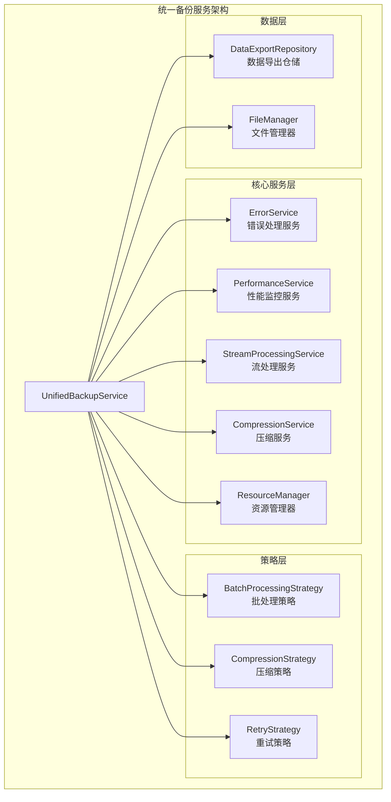
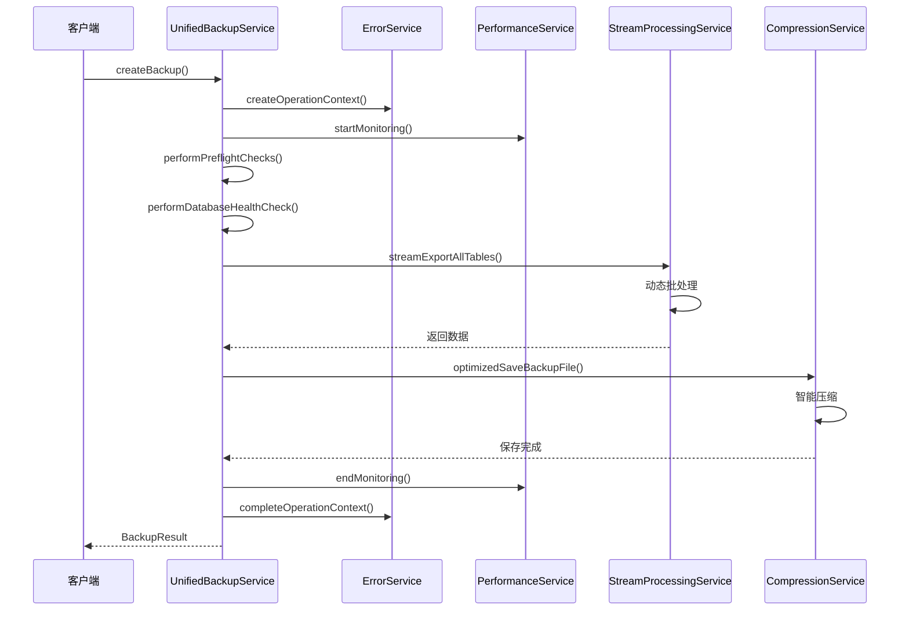
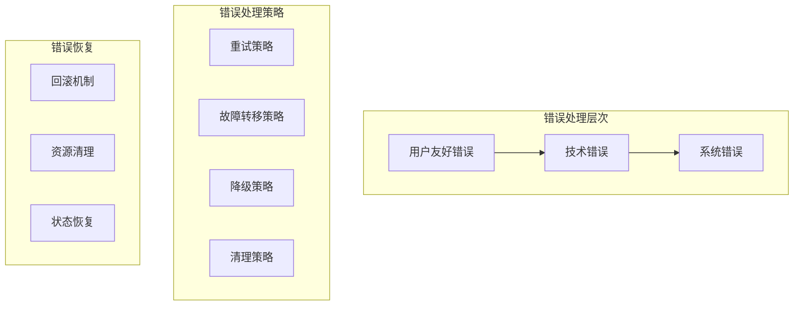

# 统一备份服务设计文档

## 概述

本设计文档描述了统一备份服务（UnifiedBackupService）的技术实现方案。该服务融合了EnhancedBackupService的稳定性特性和OptimizedBackupService的性能优化特性，提供一个既稳定又高效的备份解决方案。

## 架构

### 整体架构设计



### 服务交互流程



## 组件和接口

### 1. 核心服务接口

#### UnifiedBackupService
```dart
class UnifiedBackupService implements IBackupService {
  final DataExportRepository _dataExportRepository;
  final IErrorService _errorService;
  final IPerformanceService _performanceService;
  final IStreamProcessingService _streamProcessingService;
  final ICompressionService _compressionService;
  final IResourceManager _resourceManager;
  
  // 策略组件
  final IBatchProcessingStrategy _batchStrategy;
  final ICompressionStrategy _compressionStrategy;
  final IRetryStrategy _retryStrategy;
}
```

#### IErrorService
```dart
abstract class IErrorService {
  Future<String> createOperationContext(String operation);
  Future<UserFriendlyError> handleError(dynamic error, {
    required String operation,
    Map<String, dynamic>? context,
  });
  Future<void> completeOperationContext(String operationId, String operation, {
    required bool success,
    String? message,
    Map<String, dynamic>? result,
  });
  Future<T?> executeSafely<T>(
    Future<T> Function() operation, {
    required String operationName,
    bool logErrors = true,
  });
}
```

#### IPerformanceService
```dart
abstract class IPerformanceService {
  Future<void> startMonitoring(String operationId, int totalRecords);
  Future<void> updateProgress(String operationId, int processedRecords);
  Future<PerformanceMetrics> endMonitoring(String operationId);
  Future<List<PerformanceMetrics>> getHistoricalMetrics();
}
```

#### IStreamProcessingService
```dart
abstract class IStreamProcessingService {
  Stream<List<Map<String, dynamic>>> streamExportTable(
    String tableName,
    StreamProcessingConfig config, {
    void Function(int processed, int total)? onProgress,
  });
  
  Stream<String> streamJsonSerialize(
    Map<String, dynamic> data,
    StreamProcessingConfig config,
  );
  
  Future<Map<String, List<Map<String, dynamic>>>> streamExportAllTables(
    StreamProcessingConfig config, {
    void Function(int current, int total)? onProgress,
    CancelToken? cancelToken,
  });
}
```

#### ICompressionService
```dart
abstract class ICompressionService {
  Future<CompressionStats> compressFile(
    String inputPath,
    String outputPath, {
    int? level,
  });
  
  Future<void> decompressFile(String inputPath, String outputPath);
  Future<bool> isCompressed(String filePath);
  
  int getRecommendedCompressionLevel({
    required int dataSize,
    bool prioritizeSpeed = false,
  });
}
```

### 2. 策略接口

#### IBatchProcessingStrategy
```dart
abstract class IBatchProcessingStrategy {
  int calculateOptimalBatchSize(int totalRecords, int availableMemory);
  Duration calculateBatchDelay(int batchSize, double memoryUsage);
  bool shouldTriggerGarbageCollection(int processedBatches);
}
```

#### ICompressionStrategy
```dart
abstract class ICompressionStrategy {
  bool shouldCompress(int fileSize, BackupOptions options);
  int selectCompressionLevel(int fileSize, bool prioritizeSpeed);
  bool isCompressionEffective(CompressionStats stats);
}
```

#### IRetryStrategy
```dart
abstract class IRetryStrategy {
  bool shouldRetry(dynamic error, int attemptCount);
  Duration getRetryDelay(int attemptCount);
  int getMaxRetries(String operationType);
}
```

### 3. 数据模型

#### StreamProcessingConfig
```dart
@freezed
class StreamProcessingConfig with _$StreamProcessingConfig {
  const factory StreamProcessingConfig({
    @Default(1000) int batchSize,
    @Default(false) bool enableCompression,
    @Default(true) bool enableMemoryMonitoring,
    @Default(50) int memoryThresholdPercent,
    @Default(Duration(milliseconds: 100)) Duration batchDelay,
  }) = _StreamProcessingConfig;
}
```

#### PerformanceMetrics
```dart
@freezed
class PerformanceMetrics with _$PerformanceMetrics {
  const factory PerformanceMetrics({
    required String operationId,
    required DateTime startTime,
    required DateTime endTime,
    required int totalRecords,
    required int processedRecords,
    required int fileSize,
    required double compressionRatio,
    required int memoryPeakMB,
    required Duration processingTime,
    Map<String, dynamic>? additionalMetrics,
  }) = _PerformanceMetrics;
}
```

#### CompressionStats
```dart
@freezed
class CompressionStats with _$CompressionStats {
  const factory CompressionStats({
    required int originalSize,
    required int compressedSize,
    required double compressionRatio,
    required Duration compressionTime,
    required int compressionLevel,
  }) = _CompressionStats;
}
```

## 数据模型

### 增强的备份元数据

```dart
@freezed
class UnifiedBackupMetadata with _$UnifiedBackupMetadata {
  const factory UnifiedBackupMetadata({
    required String id,
    required String fileName,
    required DateTime createdAt,
    required int fileSize,
    required String version,
    required Map<String, int> tableCounts,
    required String checksum,
    @Default(false) bool isEncrypted,
    @Default(false) bool isCompressed,
    String? description,
    
    // 性能相关元数据
    PerformanceMetrics? performanceMetrics,
    CompressionStats? compressionStats,
    
    // 处理配置
    StreamProcessingConfig? processingConfig,
    
    // 服务信息
    @Default('UnifiedBackupService') String serviceType,
    @Default('3.0.0') String serviceVersion,
  }) = _UnifiedBackupMetadata;
}
```

### 备份文件结构

```json
{
  "metadata": {
    "id": "unified_backup_20241227_143022",
    "version": "3.0.0",
    "serviceType": "UnifiedBackupService",
    "serviceVersion": "3.0.0",
    "createdAt": "2024-12-27T14:30:22.000Z",
    "isCompressed": true,
    "compressionStats": {
      "originalSize": 10485760,
      "compressedSize": 2621440,
      "compressionRatio": 0.75,
      "compressionTime": "PT2.5S",
      "compressionLevel": 6
    },
    "performanceMetrics": {
      "processingTime": "PT45.2S",
      "memoryPeakMB": 128,
      "totalRecords": 50000,
      "recordsPerSecond": 1106
    },
    "processingConfig": {
      "batchSize": 1000,
      "enableCompression": true,
      "enableMemoryMonitoring": true
    }
  },
  "data": {
    // 表数据...
  },
  "settings": {
    // 应用设置...
  }
}
```

## 错误处理

### 错误处理架构



### 错误分类和处理

```dart
enum UnifiedBackupErrorType {
  // 系统级错误
  fileSystemError,
  databaseError,
  memoryError,
  
  // 业务级错误
  validationError,
  serializationError,
  compressionError,
  
  // 资源级错误
  insufficientSpace,
  permissionDenied,
  resourceExhausted,
  
  // 网络级错误（预留）
  networkError,
  timeoutError,
}

@freezed
class UnifiedBackupException with _$UnifiedBackupException implements Exception {
  const factory UnifiedBackupException({
    required UnifiedBackupErrorType type,
    required String message,
    required String userMessage,
    Object? originalError,
    StackTrace? stackTrace,
    Map<String, dynamic>? context,
    List<String>? suggestions,
  }) = _UnifiedBackupException;
}
```

## 测试策略

### 单元测试覆盖

1. **核心服务测试**
   - UnifiedBackupService的主要流程测试
   - 各个策略组件的独立测试
   - 错误处理和恢复机制测试

2. **性能测试**
   - 不同数据量下的性能表现
   - 内存使用情况监控
   - 批处理策略效果验证

3. **集成测试**
   - 端到端备份流程测试
   - 服务间协作测试
   - 错误场景的集成测试

### 测试数据场景

```dart
class TestScenarios {
  static const smallDataset = TestDataset(
    products: 100,
    transactions: 500,
    expectedBatchSize: 100,
    expectedDuration: Duration(seconds: 5),
  );
  
  static const mediumDataset = TestDataset(
    products: 10000,
    transactions: 50000,
    expectedBatchSize: 1000,
    expectedDuration: Duration(minutes: 2),
  );
  
  static const largeDataset = TestDataset(
    products: 100000,
    transactions: 1000000,
    expectedBatchSize: 2000,
    expectedDuration: Duration(minutes: 15),
  );
}
```

## 性能优化

### 内存优化策略

1. **流式处理**：避免将所有数据加载到内存
2. **批处理优化**：根据可用内存动态调整批处理大小
3. **垃圾回收**：在适当时机触发垃圾回收
4. **资源池**：重用临时对象减少内存分配

### 处理速度优化

1. **并行处理**：独立表的并行导出（可选）
2. **索引优化**：优化数据库查询性能
3. **缓存策略**：缓存频繁访问的元数据
4. **压缩优化**：智能选择压缩算法和级别

### 监控和调优

```dart
class PerformanceMonitor {
  void trackMemoryUsage();
  void trackProcessingSpeed();
  void trackCompressionEfficiency();
  void generateOptimizationSuggestions();
}
```

## 安全考虑

### 数据保护

1. **临时文件安全**：确保临时文件的安全创建和删除
2. **内存安全**：避免敏感数据在内存中长时间驻留
3. **访问控制**：严格的文件权限控制
4. **加密预留**：为未来的加密功能预留接口

### 完整性验证

1. **校验和验证**：多层次的数据完整性检查
2. **版本兼容性**：确保不同版本间的兼容性
3. **格式验证**：严格的文件格式验证
4. **恢复验证**：备份文件的可恢复性验证

## 用户体验设计

### 进度反馈优化

```dart
class ProgressReporter {
  void reportPreflightProgress(String stage, int progress);
  void reportExportProgress(String table, int current, int total);
  void reportCompressionProgress(int progress);
  void reportValidationProgress(int progress);
  
  String estimateRemainingTime(int processed, int total, Duration elapsed);
  String formatProgressMessage(String operation, Map<String, dynamic> details);
}
```

### 智能化功能

1. **自适应配置**：根据设备性能自动调整参数
2. **智能建议**：基于历史数据提供优化建议
3. **预测分析**：预测备份时间和文件大小
4. **健康检查**：定期检查备份系统健康状态